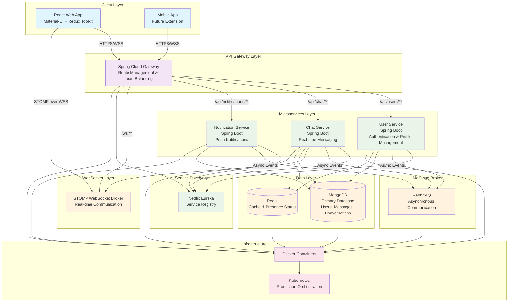

# System Architecture Diagram

## C4 Model - Container Diagram

## Key Components Description

### Client Layer
- **React Web App**: Frontend application using Material-UI for UI components and Redux Toolkit for state management
- **Mobile App**: Future mobile application (placeholder for extensibility)

### API Gateway Layer
- **Spring Cloud Gateway**: Central entry point handling routing, load balancing, and cross-cutting concerns

### Microservices Layer
- **User Service**: Handles authentication, user profiles, and social features
- **Chat Service**: Manages real-time messaging and conversation persistence
- **Notification Service**: Handles push notifications and in-app alerts

### Data Layer
- **MongoDB**: Primary database for persistent data storage
- **Redis**: Caching layer and real-time presence status management
- **RabbitMQ**: Message broker for asynchronous inter-service communication
- **STOMP WebSocket Broker**: Real-time bidirectional communication

### Infrastructure
- **Docker**: Containerization for all services
- **Kubernetes**: Production orchestration and scaling
