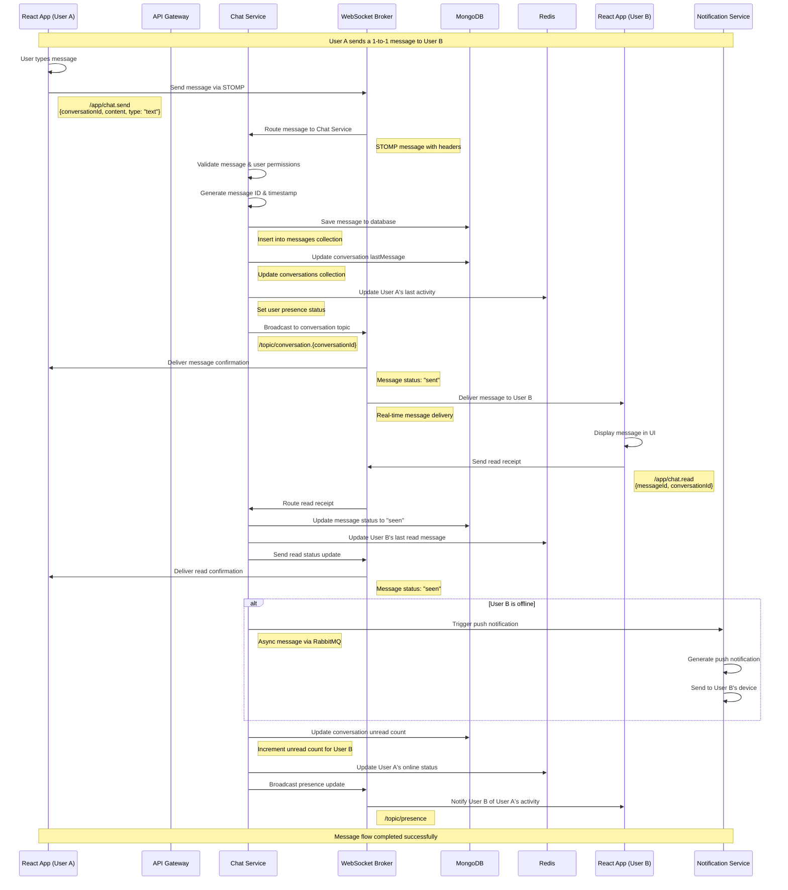

# Core Message Flow Sequence Diagram

## User A sends a 1-to-1 message to User B

This diagram illustrates the complete flow when User A sends a message to User B in the distributed chat application.

## Key Components and Data Flow

### 1. Message Sending Flow
- **Client A** sends message via WebSocket using STOMP protocol
- **API Gateway** routes WebSocket connections to Chat Service
- **Chat Service** validates, processes, and persists the message
- **MongoDB** stores the message and updates conversation metadata

### 2. Real-time Delivery
- **WebSocket Broker** handles real-time message distribution
- **Redis** manages user presence and session state
- **Clients** receive messages instantly through WebSocket connections

### 3. Message Status Tracking
- **Sent**: Message successfully sent from sender
- **Delivered**: Message received by recipient's client
- **Seen**: Recipient has read the message

### 4. Notification System
- **Notification Service** handles push notifications for offline users
- **RabbitMQ** manages asynchronous notification delivery
- **Real-time notifications** for online users via WebSocket

### 5. Data Persistence
- **MongoDB** stores all messages, conversations, and user data
- **Redis** caches presence status and session information
- **Conversation metadata** is updated in real-time

## Error Handling and Resilience

### Connection Failures
- WebSocket reconnection with exponential backoff
- Message queuing during disconnection
- Graceful degradation to polling if WebSocket fails

### Service Failures
- Circuit breaker pattern for service calls
- Message retry mechanisms
- Fallback to cached data when services are unavailable

### Data Consistency
- Eventual consistency for message delivery
- Idempotent message processing
- Conflict resolution for concurrent updates

## Performance Considerations

### Message Throughput
- Horizontal scaling of Chat Service instances
- Load balancing across multiple WebSocket brokers
- Database sharding for high-volume conversations

### Latency Optimization
- Message caching in Redis
- Connection pooling for database access
- Asynchronous processing for non-critical operations

### Resource Management
- Connection limits per user
- Message rate limiting
- Memory management for WebSocket connections
